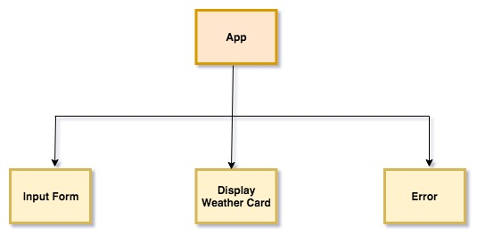

# Weather App

#### Using React

#### By Sheila Stephen

## Description

This is a weather forecast App that pulls weatehr data for the city entered by the user.

## Comopnent Structure

## Minimum Viable Product(MVP)

* The user can enter a city and country
* The user can get the weather in that location
* The user can also see the forecast for the next 5-days.

## Further Exploration

* To display a map with the current weather conditions.

## Setup/Installation Requirements

* Clone this project with `git clone https://github.com/sheilaje/weatherAppPlanningRepo`
* create a .env file in the root folder. store the api key in a variable like this - REACT_APP_anyName = 'YOUR-API-KEY' (The Api kay stored in the .env file should be stored in a variable name of format -   REACT_APP_variablename   and for accessing this API key in the code you shoud use like this - process.env.REACT_APP_variablename )
* Run `npm install` to install dependencies
* Run `npm run start` to build and serve the project
* View the project in any browser at `http://localhost:8080/`

## Known Bugs

There are no known bugs at this time.

## Support and contact details

If you discover a bug or would like to make a suggestion, email me at sheila.je@gmail.com

## Technologies Used

* React
* Webpack
* Open weather map API

### License

MIT license.

Copyright (c) 2019 **Sheila Stephen**
